# Padea Catering System — Process Diagram

```mermaid
flowchart TD
    A([Thursday 9am\nWeekly Trigger]) --> B[generate_order.py]

    B --> C{For each session\nnext week}

    C --> D{Session\ncancelled?\nexclusions.pdf}
    D -- Yes, full cancel --> SKIP([Skip — no order])
    D -- Yes, partial cancel --> E[Filter out\nexcluded year levels]
    D -- No --> E

    E --> F[Get enrolled students\nenrollments table]
    F --> G[Remove opted-out students\nstudents.opted_out = true]
    G --> H[Remove absent students\nabsences table]
    H --> I[meal_count = remaining\nattending students]

    I --> J[Collect dietary restrictions\nfor attending students]
    J --> K{Check for\nmanager override?}
    K -- Yes --> L[Use override manager\n+ mobile]
    K -- No --> M[Use default session\nmanager + mobile]

    L & M --> N[Session attendance\npackage ready]

    N --> O{All sessions\nfor caterer\ncollected?}
    O -- More sessions --> C
    O -- Done --> P

    P[Group sessions\nby caterer] --> Q

    Q{Min order\ncheck} -- Below minimum --> WARN([⚠ Warning:\nnotify coordinator])
    Q -- OK --> R

    R[Call Claude API\nwith:\n- caterer menu\n- dietary constraints\n- meal counts\n- past feedback] --> S[Claude selects\nN menu items\n+ quantities per session]

    S --> T[Validate:\nevery dietary\nrestriction covered?]
    T -- No --> R
    T -- Yes --> U

    U[Generate order email\nsubject + body\nwith delivery details,\nbuilding, manager mobile] --> V{Who to\ncontact?}

    V --> W{Chef wants\nCC?}
    W -- Yes\ne.g. GYG chef --> X[TO: primary contact\nCC: chef]
    W -- No\ne.g. Terrific Noodles chef --> Y[TO: primary contact\nno CC]

    X & Y --> Z[Save order to DB\nstatus: draft]

    Z --> AA([send_orders.py\nreads draft orders\nand sends emails])

    AA --> AB[Caterer receives order\nconfirms via reply]

    AB --> AC([Session day:\ncaterer delivers\n5–10 min before dinner])

    AC --> AD[On-site manager\nreceives delivery\nwith driver's help]

    AD --> AE([Post-session:\nmanager submits\nfeedback form])

    AE --> AF[Feedback saved to DB\nmenu_item + rating + notes]

    AF --> AG([Next Thursday:\nClaude reads feedback\nto improve meal selection])

    AG --> A
```



## Data Flow Summary

| Step | Actor | Data In | Data Out |
|---|---|---|---|
| Attendance calc | System | enrollments, absences, exclusions | meal_count per session |
| Dietary check | System | student_dietary | restriction list per session |
| Meal selection | Claude API | menu items, dietary constraints, feedback history | selected items + quantities |
| Email generation | System | meal selection, session details, contacts | formatted order email |
| Email delivery | SMTP | email content | sent email (to/cc caterer) |
| Feedback | On-site manager | Fillout form | rating + notes per item |
| Quality tracking | Claude API | feedback history | improved future selections |

## Edge Cases Handled

| Edge Case | Handling |
|---|---|
| Full session cancellation (e.g. ISHS Thu – Open Day) | Detected via `session_exclusions`; session skipped entirely |
| Partial cancellation by year level (e.g. CHAC Wed – only Yr 11) | `year_levels_excluded` filter removes affected students before count |
| Student opted out of catering | `opted_out_of_catering = true` on student; excluded from meal count |
| Student absent this week | `absences` table entry; excluded from count for that date only |
| Caterer chef does NOT want CC (Terrific Noodles) | `cc_on_orders = false` on chef contact record |
| Caterer chef DOES want CC (GYG) | `cc_on_orders = true`; email CC'd automatically |
| Minimum order quantity constraint | Computed per caterer per week across all schools; max items limited accordingly |
| Lakehouse near-minimum (16 meals, min is 15 for 4 items) | System caps at 4 items; coordinator warned if below minimum |
| Complex dietary (e.g. Halal + Vegetarian) | Claude prompt requires item satisfying BOTH constraints simultaneously |
| Manager changes for a session | `manager_overrides` table; system uses override if exists |
```
